# Documentación de Módulos del Sistema

## Módulo 1. Accesos al Sistema

## Descripción General

El módulo **Accesos al Sistema** es el primer módulo del aplicativo y el encargado de garantizar que únicamente usuarios autorizados puedan acceder a la plataforma de forma segura.

Este módulo administra todo el ciclo de vida del acceso de un usuario, desde su registro inicial hasta el inicio de sesión, recuperación de contraseña y asignación automática de permisos según el rol correspondiente.

### Procesos del módulo

* Registro de usuarios.
* Verificación de identidad mediante correo electrónico.
* Verificación de mayoría o minoría de edad.
* Consentimiento de acudiente para menores de edad.
* Registro biométrico.
* Inicio de sesión.
* Definición automática del rol.
* Derechos de acceso.
* Restablecimiento de contraseña.

---

# 1. Registro de Usuarios

El registro permite crear una nueva cuenta dentro del sistema.

Durante este proceso el sistema valida la identidad básica del usuario, verifica su correo electrónico, determina su edad y, cuando aplica, solicita el consentimiento de un adulto responsable.

## Información solicitada

Todo usuario deberá registrar la siguiente información:

* Nombre.
* Apellidos.
* Tipo de documento.
* Número de documento.
* Correo electrónico.
* Contraseña.
* Confirmación de contraseña.
* Fecha de nacimiento.
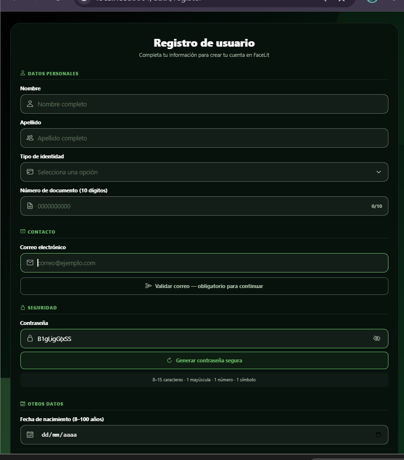

## Validaciones del formulario

### Nombre

* Solo acepta letras.
* No permite números.
* No permite caracteres especiales.

### Apellidos

* Solo acepta letras.
* No permite números.
* No permite caracteres especiales.
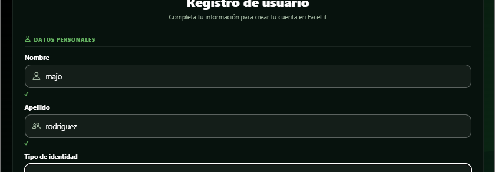

### Tipo de documento

El usuario deberá seleccionar uno de los siguientes tipos:

* Tarjeta de Identidad (TI).
* Cédula de Ciudadanía (CC).
* Cédula de Extranjería (CE).
* Pasaporte (PA).

No podrá continuar sin seleccionar uno.

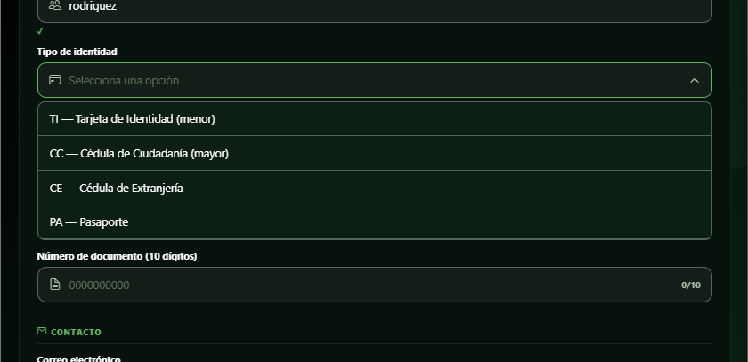

### Número de documento

El sistema únicamente permitirá:

* Números.
* Máximo 10 dígitos.
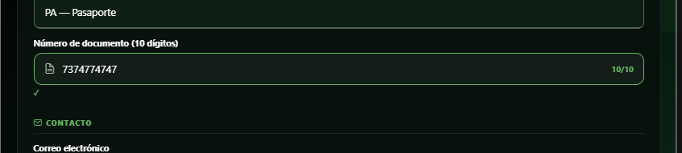

No se permiten:

* Letras.
* Símbolos.
* Más de 10 dígitos.

### Correo electrónico

El correo debe cumplir un formato válido.

Además:

* No puede existir previamente.
* Será verificado antes de finalizar el registro.

### Contraseña

Debe cumplir las siguientes reglas:

* Entre 8 y 15 caracteres.
* Al menos una letra mayúscula.
* Al menos una letra minúscula.
* Al menos un número.
* Al menos un símbolo.

La contraseña nunca será almacenada en texto plano.

Será cifrada antes de almacenarse en la base de datos.

---

# 2. Verificación del Correo Electrónico

Después de ingresar el correo electrónico, el sistema enviará automáticamente un código de verificación de **6 dígitos**.

El usuario deberá ingresar dicho código para confirmar que el correo realmente le pertenece.

Sin esta validación no podrá continuar el registro.

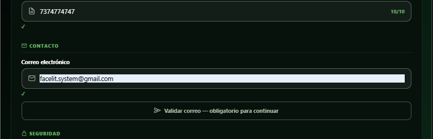
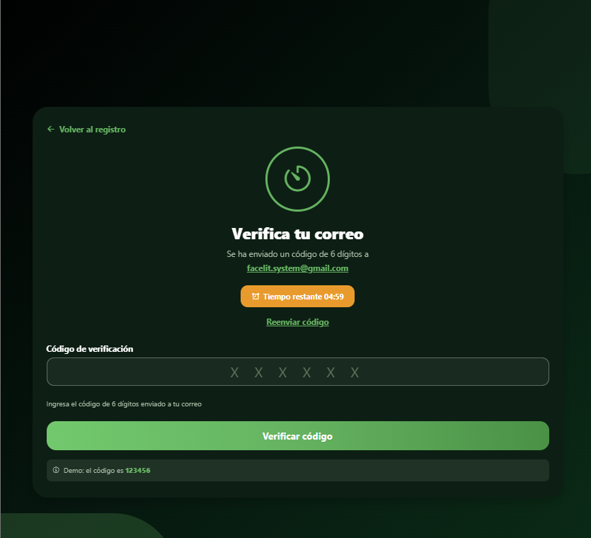
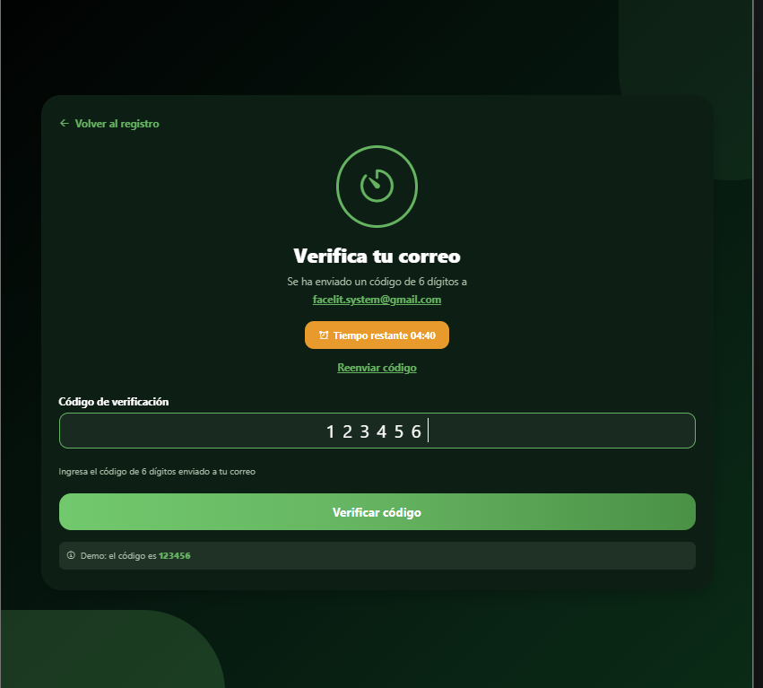
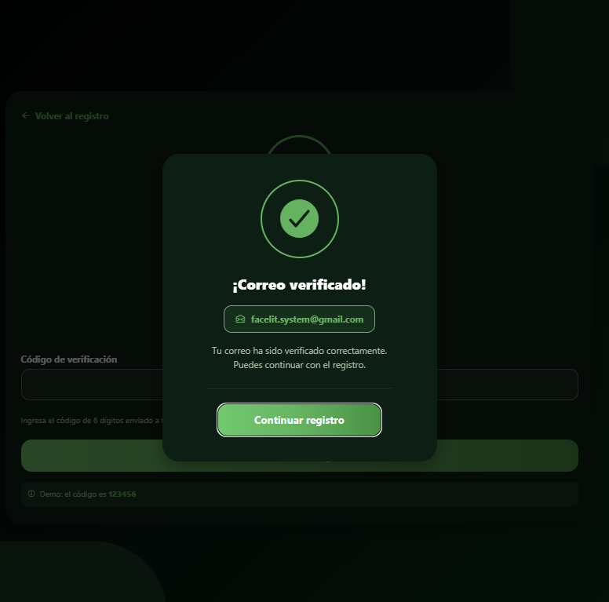
## Código de verificación

Características:

* 6 dígitos.
* Un solo uso.
* Vigencia de 5 minutos.

Si el código vence, el sistema mostrará el mensaje:

> El código ha expirado. Solicite uno nuevo.

---

# 3. Verificación de Edad

Una vez ingresada la fecha de nacimiento, el sistema calculará automáticamente la edad del usuario.

Solo se permitirán registros entre:

* 8 años.
* 100 años.

Cualquier edad fuera de este rango bloqueará el registro.

## Consistencia entre documento y edad

El sistema también validará que el tipo de documento sea coherente con la edad registrada.

Por ejemplo:

* Si selecciona **Cédula de Ciudadanía (CC)**, la fecha de nacimiento no podrá indicar que el usuario es menor de edad.
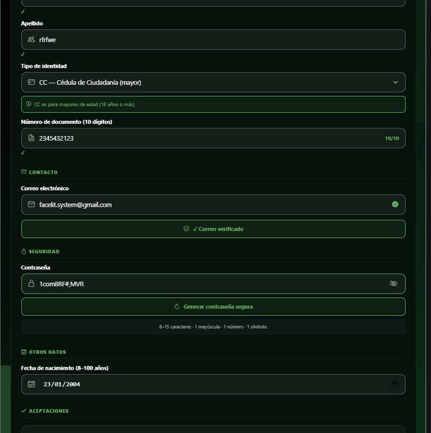
* Si selecciona **Tarjeta de Identidad (TI)**, deberá corresponder a un usuario menor de edad.
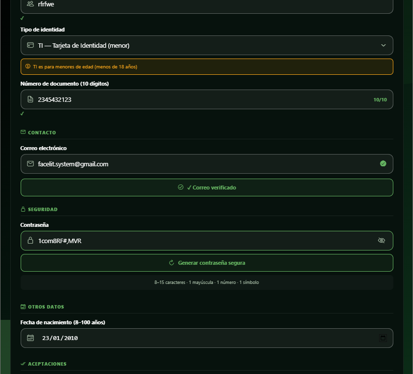

Estas validaciones buscan evitar inconsistencias en la información registrada.

---

# 4. Registro de Menores de Edad

Si el sistema detecta automáticamente que el usuario es menor de 18 años, el flujo de registro cambiará.

El usuario será redirigido inmediatamente al módulo de consentimiento del acudiente.

## Información del acudiente

Se solicitarán los siguientes datos:

* Nombre completo.
* Número de documento.
* Correo electrónico.

### Validaciones

El sistema verificará que:

* El correo del acudiente sea diferente al correo del menor.
* El correo tenga un formato válido.


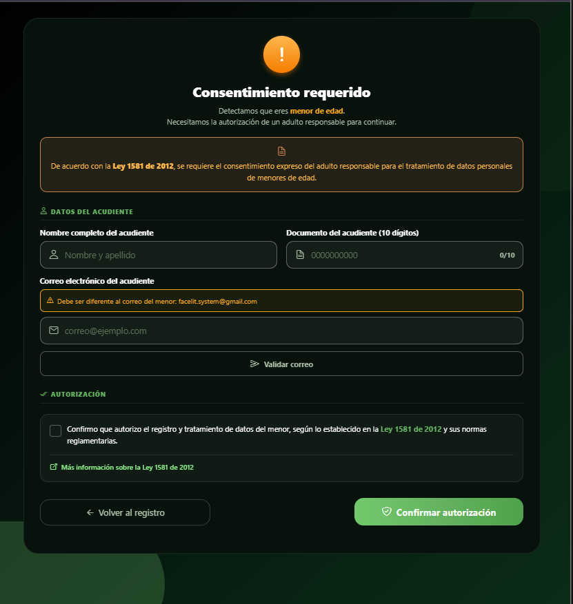

## Verificación del correo del acudiente

Después de ingresar el correo del acudiente, el sistema enviará un token de verificación.

Características:

* Un solo uso.
* Vigencia de 5 minutos.

Mientras el token no sea validado:

* El menor no podrá continuar el registro.
* No podrá acceder al sistema.


## Consentimiento

Una vez verificado el correo del acudiente, este deberá aceptar el consentimiento para el tratamiento de datos personales del menor.

Si el consentimiento es rechazado o nunca es confirmado:

* El registro será cancelado.

---

# 5. Derechos de Acceso

Durante el proceso de registro el usuario deberá leer y aceptar el documento denominado **Derechos de Acceso**.

Este documento informa sobre:

* Derecho de acceso.
* Derecho de actualización.
* Derecho de rectificación de datos personales.

Mientras no acepte este documento:

* El botón para continuar permanecerá deshabilitado.

El sistema almacenará la aceptación para fines de trazabilidad.

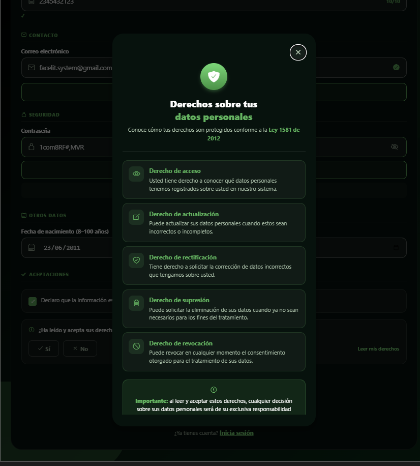

---

# 6. Declaración de Responsabilidad

Antes de finalizar el registro el sistema mostrará un aviso indicando que:

> El usuario es responsable por la veracidad de la información suministrada.

Si posteriormente se demuestra falsedad en los datos registrados, la responsabilidad recaerá sobre el usuario o su acudiente y no sobre la aplicación.

---

# 7. Finalización del Registro

Cuando el usuario complete correctamente todo el proceso:

* Datos personales.
* Correo verificado.
* Edad validada.
* Consentimiento (si aplica).
* Derechos de acceso aceptados.

El sistema permitirá continuar al siguiente módulo.

---

# 8. Registro Biométrico

Una vez finalizado el registro, el usuario será dirigido automáticamente al proceso de captura facial.

Este paso aplica para:

* Usuarios mayores de edad.
* Usuarios menores de edad que hayan completado correctamente el consentimiento del acudiente.

La captura facial permitirá registrar la biometría utilizada posteriormente por el sistema para el reconocimiento facial.

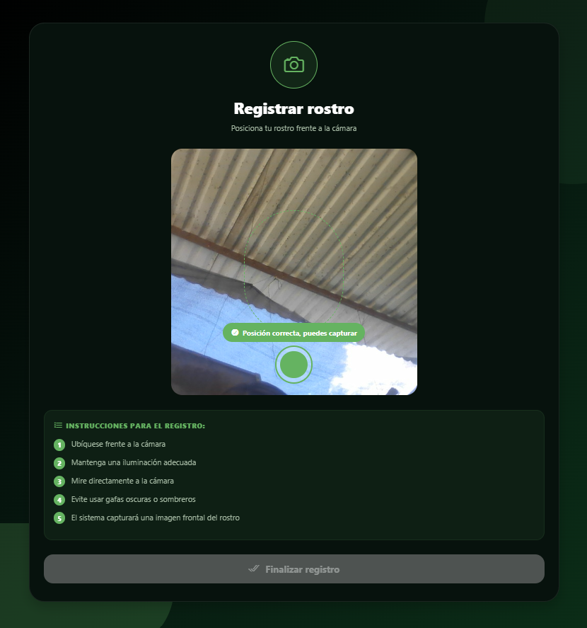
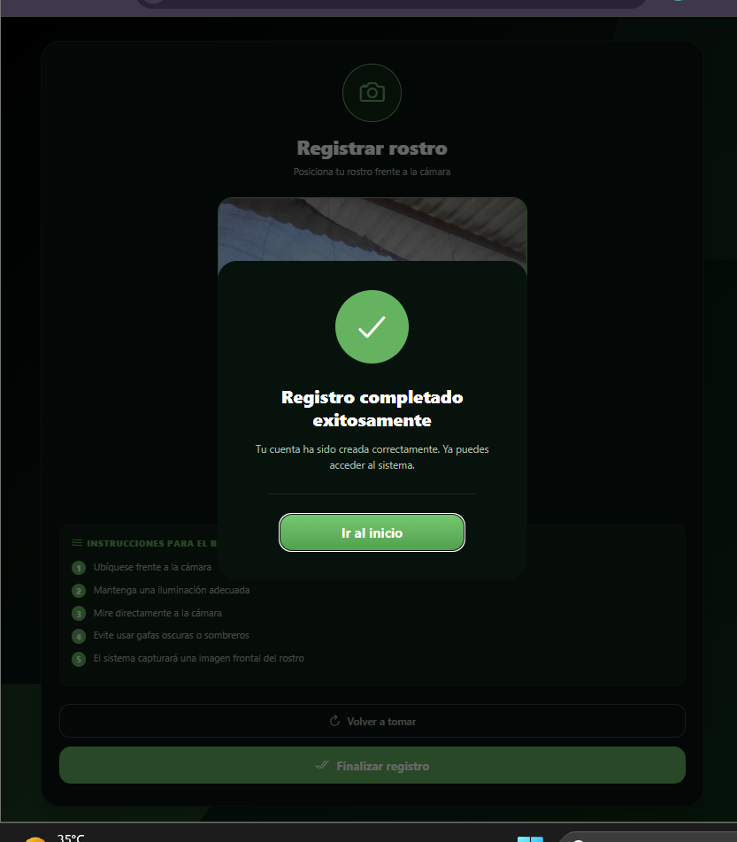
---

# 9. Inicio de Sesión

Una vez registrado, el usuario podrá acceder mediante:

* Correo electrónico.
* Contraseña.

El sistema verificará:

* Que el correo exista.
* Que la contraseña coincida con la almacenada.
* Que ambas credenciales pertenezcan al mismo usuario.

Las contraseñas siempre serán comparadas mediante algoritmos de cifrado seguro.

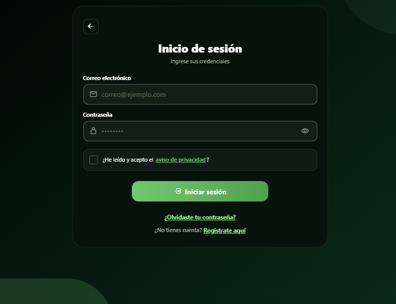

## Términos y Condiciones

Durante el inicio de sesión el usuario deberá aceptar los Términos y Condiciones.

Mientras no los acepte:

* No podrá iniciar sesión.

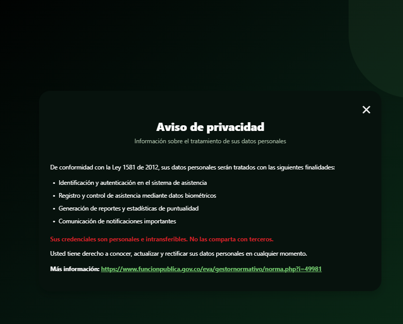

---

# 10. Definición Automática del Rol

Después de autenticar correctamente al usuario, el sistema consultará el rol asignado.

El rol no es seleccionado por el usuario.

Es asignado únicamente por un Administrador.

Según el rol obtenido, el sistema habilitará automáticamente:

* Menús.
* Funcionalidades.
* Permisos.
* Accesos.

Roles disponibles:

* Administrador.
* Instructor.
* Aprendiz.

Si el usuario no tiene un rol activo:

* El sistema bloqueará el acceso y mostrará un mensaje indicando que debe comunicarse con un administrador.

---

# 11. Restablecimiento de Contraseña

Si el usuario olvida su contraseña podrá utilizar la opción:

**¿Olvidaste tu contraseña?**

## Flujo

1. Ingresa el correo con el que se registró.
2. El sistema verifica que exista.
3. Envía un código de verificación.
4. El usuario ingresa el código recibido.
5. Si el código es correcto podrá crear una nueva contraseña.
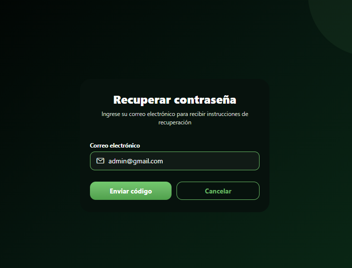

## Código de recuperación

Características:

* Un solo uso.
* Vigencia de 5 minutos.

Si el tiempo expira:

* El sistema solicitará generar un nuevo código.
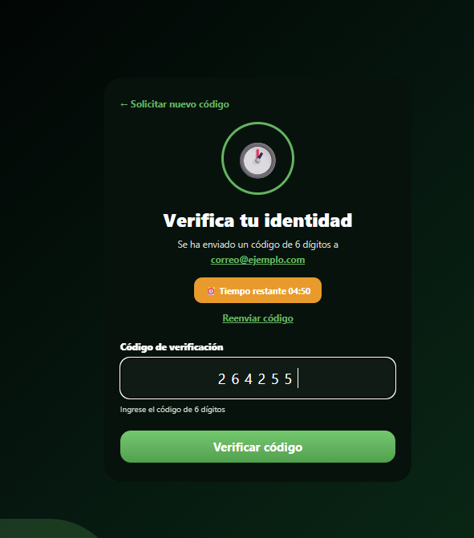

## Nueva contraseña

La nueva contraseña deberá cumplir las mismas políticas del registro:

* Entre 8 y 15 caracteres.
* Una mayúscula.
* Una minúscula.
* Un número.
* Un símbolo.

Después de actualizarla:

* La contraseña anterior quedará invalidada.
* Todos los códigos utilizados serán eliminados automáticamente.

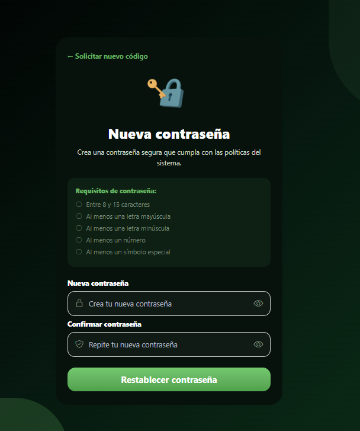
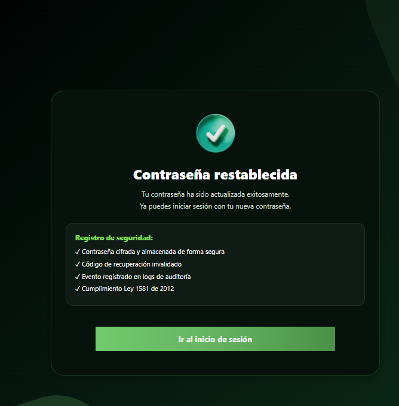

---

# Flujo General del Módulo

```text
Usuario
   │
   ▼
Registro
   │
   ▼
Validación de datos
   │
   ▼
Verificación del correo
   │
   ▼
Cálculo de edad
   │
   ├───────────────┐
   │               │
Mayor            Menor
   │               │
   ▼               ▼
 Continúa      Consentimiento
                 del acudiente
                     │
                     ▼
             Verificación del
             correo del acudiente
                     │
                     ▼
             Consentimiento aprobado
                     │
                     ▼
          Registro biométrico facial
                     │
                     ▼
            Cuenta creada correctamente
                     │
                     ▼
              Inicio de sesión
                     │
                     ▼
        Validación de credenciales
                     │
                     ▼
        Consulta automática del rol
                     │
                     ▼
      Acceso al sistema según permisos
```

---

# Reglas de Negocio

## Registro

* Solo se permiten usuarios entre 8 y 100 años.
* Los nombres y apellidos solo aceptan letras.
* El documento solo acepta números y un máximo de 10 dígitos.
* El usuario debe seleccionar un tipo de documento válido (TI, CC, CE o PA).
* El correo debe verificarse mediante un código de 6 dígitos con vigencia de 5 minutos.
* Las contraseñas deben cumplir las políticas de seguridad.
* El usuario debe aceptar los Derechos de Acceso.
* El sistema mostrará un aviso indicando que la responsabilidad de los datos suministrados recae sobre el usuario o su acudiente.

## Menores de edad

* Si el usuario es menor de 18 años, el sistema solicitará obligatoriamente la información del acudiente.
* El correo del acudiente debe ser diferente al del menor.
* El correo del acudiente se validará mediante un token con vigencia de 5 minutos.
* Sin la verificación del correo y el consentimiento del acudiente, el registro no podrá finalizar.

## Inicio de sesión

* Solo podrán iniciar sesión usuarios previamente registrados.
* El usuario deberá aceptar los Términos y Condiciones.
* El sistema autenticará las credenciales mediante contraseñas cifradas.
* Tras la autenticación se asignará automáticamente el rol correspondiente.

## Restablecimiento de contraseña

* El usuario deberá verificar su identidad mediante un código enviado al correo registrado.
* El código tendrá una vigencia de 5 minutos.
* La nueva contraseña deberá cumplir las mismas políticas del registro.
* Una vez restablecida, la contraseña anterior quedará invalidada automáticamente.
