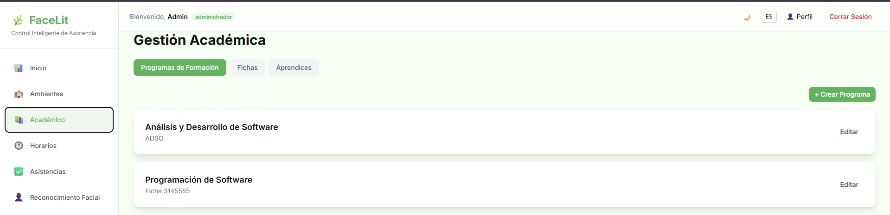
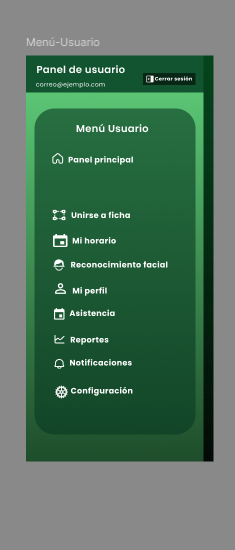
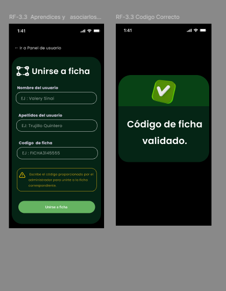
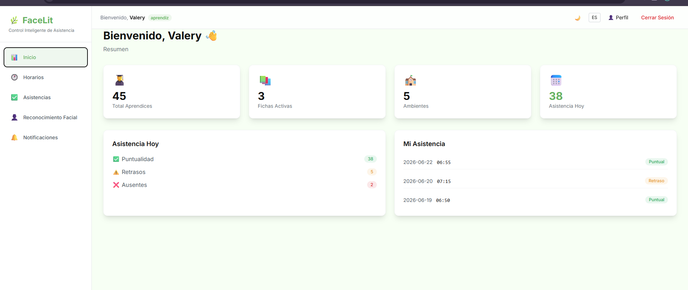

# Módulo de Gestión Académica

## Descripción General

El módulo de **Gestión Académica** permite administrar la estructura de formación dentro de la plataforma mediante la gestión de programas de formación, fichas y la asociación de aprendices.

El **Administrador** es el responsable de gestionar toda la estructura académica, mientras que el **Aprendiz** únicamente puede vincularse a una ficha mediante un código generado previamente por el sistema.

---

# 1. Gestión de Programas de Formación

El Administrador tiene control total sobre los programas de formación.

## Funcionalidades

* Registrar programas de formación.
* Consultar programas registrados.
* Editar programas.
* Eliminar programas.

## Información del programa

Cada programa contiene como mínimo:

* Nombre del programa.
* Estado (Activo / Inactivo).

Los programas representan la estructura principal sobre la cual se organizan las fichas de formación.

---

# 2. Gestión de Fichas de Formación

Una vez existen programas registrados, el Administrador puede gestionar las fichas.

## Funcionalidades

* Registrar fichas.
* Consultar fichas.
* Editar fichas.
* Eliminar fichas.

Cada ficha contiene información como:

* Número de la ficha.
* Jornada.
* Estado.
* Código único de acceso.

---

## Relación entre Programas y Fichas

La relación entre programas y fichas es de tipo **Uno a Muchos (1:N)**.

* Un programa de formación puede tener múltiples fichas asociadas.
* Cada ficha pertenece únicamente a un programa de formación.

Ejemplo:

```text
Programa ADSO
│
├── Ficha 3145555
├── Ficha 3145556
├── Ficha 3145557
└── Ficha 3145558
```

---

## Asociación de una ficha a un programa

Durante el registro de una ficha, el Administrador deberá seleccionar el programa de formación al cual pertenecerá.

El sistema no permitirá registrar fichas sin un programa asociado.

---

## Desvincular una ficha de un programa

El sistema permitirá eliminar únicamente la relación entre una ficha y su programa de formación.

Esta acción **NO elimina la ficha del sistema**.

Después de la desvinculación, la ficha continuará existiendo y podrá asociarse nuevamente a otro programa de formación.

### Diferencia entre eliminar y desvincular

### Eliminar ficha

* Elimina completamente la ficha del sistema.
* Solo puede realizarse desde el módulo de administración de fichas.

### Desvincular ficha del programa

* Elimina únicamente la relación entre la ficha y el programa.
* La ficha permanece registrada.
* Puede asociarse posteriormente a otro programa.

# Esto se puede organizar en esta parte (SOLO PARA ADMIN) 


---

# 3. Gestión de Asociación de Aprendices a una Ficha

Cada aprendiz únicamente podrá estar asociado a **una ficha activa al mismo tiempo**.

---

## Registro del Aprendiz

Cuando el aprendiz ingrese por primera vez a la plataforma tendrá disponible la opción:

**Unirse a ficha**

Desde allí deberá ingresar:

* Nombre.
* Apellidos.
* Código de la ficha.

---

## Validaciones

El sistema verificará que:

* El código exista.
* La ficha esté activa.
* El código corresponda a una ficha válida.
* El aprendiz no pertenezca ya a otra ficha.

---

## Asociación exitosa

Si todas las validaciones son correctas, el sistema:

* Registra al aprendiz.
* Lo asocia automáticamente a la ficha.
* Guarda la información en la base de datos.
* Muestra el mensaje:

> Código de ficha validado.

Finalmente, el sistema deshabilita automáticamente la opción **"Unirse a ficha"**.

-------------
# Lo que ve el aprendiz




---
# Aqui se debe emplementar lo de " Uniser a ficha " en el sideber 


# Restricción de Asociación

Una vez el aprendiz queda asociado a una ficha:

* No podrá ingresar un nuevo código.
* No podrá cambiar de ficha.
* No podrá eliminar su propia asociación.
* La opción **"Unirse a ficha"** permanecerá deshabilitada.

El objetivo es garantizar que un aprendiz pertenezca únicamente a una ficha de formación.

---

# Corrección de una Asociación

Si un aprendiz ingresa un código incorrecto o queda asociado a una ficha que no le corresponde, no podrá modificar esa relación por su cuenta.

Será necesaria la intervención del Administrador.

---

# Administración de Aprendices por Ficha

Cada ficha contará con una vista donde el Administrador podrá consultar todos los aprendices asociados.

La información mostrada será similar a la siguiente:

| Campo     | Descripción            |
| --------- | ---------------------- |
| Usuario   | Nombre del aprendiz    |
| Documento | Documento de identidad |
| Email     | Correo electrónico     |
| Rol       | Rol del usuario        |
| Estado    | Estado de la cuenta    |
| Acciones  | Editar y Desvincular   |

---

## Acciones disponibles

### Editar

Permite modificar la información del aprendiz.

### Desvincular

Permite eliminar únicamente la relación entre el aprendiz y la ficha.

Esta acción:

* NO elimina al aprendiz del sistema.
* NO elimina la ficha.
* Solo elimina la asociación existente.

Después de la desvinculación:

* El aprendiz deja de pertenecer a la ficha.
* El sistema vuelve a habilitar la opción **"Unirse a ficha"**.
* El aprendiz podrá ingresar nuevamente el código correcto.

---

# Flujo General del Sistema

```text
Administrador
      │
      ▼
Crea Programas
      │
      ▼
Registra Fichas
      │
      ▼
Asocia cada ficha a un Programa
      │
      ▼
Sistema genera un Código Único
      │
      ▼
Aprendiz inicia sesión
      │
      ▼
Selecciona "Unirse a ficha"
      │
      ▼
Ingresa sus datos y el código
      │
      ▼
Sistema valida:
• Existe la ficha
• Está activa
• El código es válido
• El aprendiz no pertenece a otra ficha
      │
      ▼
Código válido
      │
      ▼
Aprendiz asociado correctamente
      │
      ▼
Sistema deshabilita
"Unirse a ficha"
      │
      ▼
Si existe un error de asociación
      │
      ▼
Administrador consulta los aprendices
de la ficha correspondiente
      │
      ▼
Desvincula al aprendiz
      │
      ▼
El sistema habilita nuevamente
"Unirse a ficha"
      │
      ▼
El aprendiz puede ingresar el código
correcto y asociarse a la ficha adecuada.
```

---

# Reglas de Negocio

## Programas

* Solo los Administradores pueden crear, editar, eliminar y consultar programas.
* Un programa puede tener múltiples fichas asociadas.

---

## Fichas

* Toda ficha debe pertenecer a un programa de formación.
* No pueden existir fichas sin un programa asociado.
* Una ficha puede desvincularse de un programa sin ser eliminada.
* La eliminación de una ficha solo puede realizarse desde el módulo de gestión de fichas.
* Cada ficha posee un código único para el registro de aprendices.

---

## Aprendices

* Cada aprendiz solo puede pertenecer a una ficha activa.
* El aprendiz no puede cambiar de ficha por iniciativa propia.
* El aprendiz no puede ingresar un nuevo código mientras permanezca asociado a una ficha.
* La opción **"Unirse a ficha"** se deshabilita automáticamente después de una asociación exitosa.
* Solo un Administrador puede eliminar la relación entre un aprendiz y una ficha.
* La desvinculación no elimina al aprendiz del sistema.
* Al desvincular un aprendiz, el sistema vuelve a habilitar la opción **"Unirse a ficha"**.
* El sistema debe impedir registros duplicados.
* El código de ficha debe existir y encontrarse activo para permitir la asociación.

---

# Modelo Conceptual

```text
Programa de Formación
        │
        │ 1
        │
        ├───────────────────────────┐
        │                           │
        ▼                           ▼
    Ficha 1                     Ficha 2
        │                           │
        │                           │
        ├──────────────┐            ├──────────────┐
        ▼              ▼            ▼              ▼
Aprendiz A      Aprendiz B    Aprendiz C    Aprendiz D

Reglas:

• Un Programa puede tener muchas Fichas.
• Una Ficha pertenece a un único Programa.
• Una Ficha puede tener múltiples Aprendices.
• Un Aprendiz solo puede pertenecer a una Ficha.
```

## Objetivo del módulo

Este módulo busca mantener una estructura académica organizada y consistente, permitiendo al Administrador gestionar programas, fichas y asociaciones de aprendices de manera centralizada. Asimismo, garantiza que cada aprendiz permanezca vinculado a una única ficha, evitando registros duplicados, cambios no autorizados y errores en la asignación, al tiempo que ofrece mecanismos de desvinculación controlados para corregir asociaciones cuando sea necesario.
